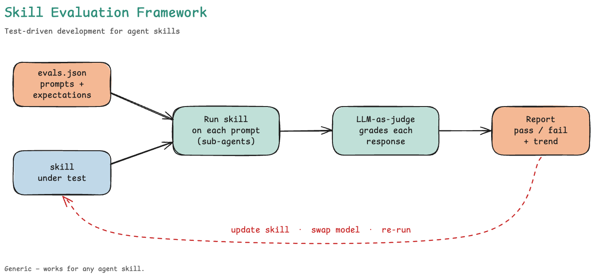

# Skill Eval Runner

> **Skill:** [`skills/skill-eval-runner/`](../../../skills/skill-eval-runner/) — see [SKILL.md](../../../skills/skill-eval-runner/SKILL.md) for the agent-facing definition.

Test-driven development for agent skills. Given a list of test cases (prompts + expectations), the skill-eval-runner executes each prompt against the skill, grades the responses with an LLM-as-judge, and produces a report you can re-open after every skill update or model swap to see how quality moves.



## Why This Exists

Three things become possible once a skill has an eval suite:

- **Catch regressions** before they ship — every change to a skill or its knowledge base runs the same prompts and you see what moved.
- **Benchmark models** on the skills *you actually care about* — swap the underlying model, re-run, compare. Public leaderboards don't reflect your prompts.
- **TDD for skills** — write the evals first, iterate the skill until the bar goes green. Same discipline you already use for code.

The framework is generic and works for any agent skill. We use it on REFLEX expert skills.

## End-to-End Workflow

```
/skill-eval-generator <skill-name>   →   scaffolds evals/skills/{skill}/evals.json
/skill-eval-runner    <skill-name>   →   executes, grades, opens the report
                                            ↑
                                        update skill, swap model, re-run
```

[`/skill-eval-generator`](../skill-eval-generator/README.md) browses a skill's SKILL.md and references to produce a starter `evals.json` with `[auto]`-prefixed expectations for human refinement. Once you have an `evals.json`, `/skill-eval-runner` takes over.

## Pipeline

The skill-eval-runner follows a 4-phase pipeline:

| Phase | What happens | Output |
|-------|-------------|--------|
| **PREPARE** | Reads `evals/skills/{skill-name}/evals.json`, validates test cases, sets up workspace | `workspace/` directory with per-eval folders |
| **EXECUTE** | Dispatches each test case to sub-agents that run the target skill | `response.md` + `metrics.json` per variant |
| **GRADE** | Grader (LLM-as-judge) scores each response against expectations, comparator does blind A/B | `grading.json`, `comparison.json`, `benchmark.json` |
| **REPORT** | Aggregates results, launches eval-viewer, presents summary | `benchmark.md`, eval-viewer HTML |

## When To Use

- You updated a skill and want to verify it still passes its eval suite
- You updated a knowledge base and regenerated a skill
- You want to compare quality between two iterations of a skill

## When NOT To Use

- You want to create eval test cases — use [`/skill-eval-generator`](../skill-eval-generator/README.md) instead
- You want to validate repository structure — use `npm run validate` instead

## Usage

```
/skill-eval-runner skill-optimiser
```

The skill accepts any skill name that has a corresponding `evals/skills/{skill-name}/evals.json` file.

To list all skills with evals:
```bash
python skills/skill-eval-runner/scripts/list_evals.py
```

## Anatomy of an Eval

Each test case is a prompt plus a list of pass/fail expectations the response must meet:

```json
{
  "id": 1,
  "name": "import-validation-failure",
  "prompt": "The nightly import job failed with a record validation error...",
  "expectations": [
    "Response identifies record validation failure as root cause",
    "Confidence is HIGH or >= 80"
  ]
}
```

Expectations are graded individually by the LLM-as-judge — you see exactly which ones passed, which failed, and the verbatim evidence the judge looked at. See [schemas.md](../../../skills/skill-eval-runner/references/schemas.md) for the full `evals.json` spec including optional fields (`files`, `expected_output`, `skill_version`).

## Eval Viewer

The eval-viewer (`skills/skill-eval-runner/eval-viewer/`) provides a browser-based interface with three views:

- **Review** — per eval: prompt, response, per-expectation grading with evidence, and an A/B comparison between skill versions or against the no-skill baseline
- **Benchmark** — per iteration: headline pass rate, cost overhead, quality scores (radar + dumbbell), contradictions, skill regressions, per-eval scorecard
- **Progression** — across iterations: pass-rate trend, heatmap, resource usage, skill-feedback rollup — *the loop in action*

## Further Reading

- [SKILL.md](../../../skills/skill-eval-runner/SKILL.md) — full skill definition with phase details and agent coordination
- [schemas.md](../../../skills/skill-eval-runner/references/schemas.md) — authoritative JSON schemas for `evals.json`, `grading.json`, `benchmark.json`
- [skill-eval-grader.agent.md](../../../agents/skill-eval-grader.agent.md) — LLM-as-judge grading agent
- [skill-eval-analyzer.agent.md](../../../agents/skill-eval-analyzer.agent.md) — benchmark analysis agent
- [skill-eval-comparator.agent.md](../../../agents/skill-eval-comparator.agent.md) — A/B comparison agent
- [skill-eval-executor.agent.md](../../../agents/skill-eval-executor.agent.md) — test case execution agent

## Contributing

See [CONTRIBUTING.md](CONTRIBUTING.md) for how to improve the skill-eval-runner.
